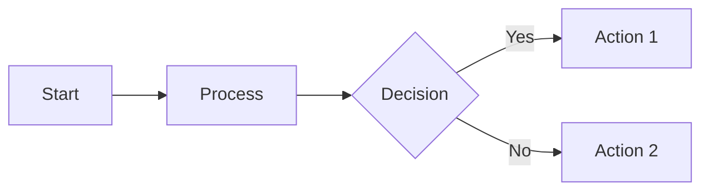
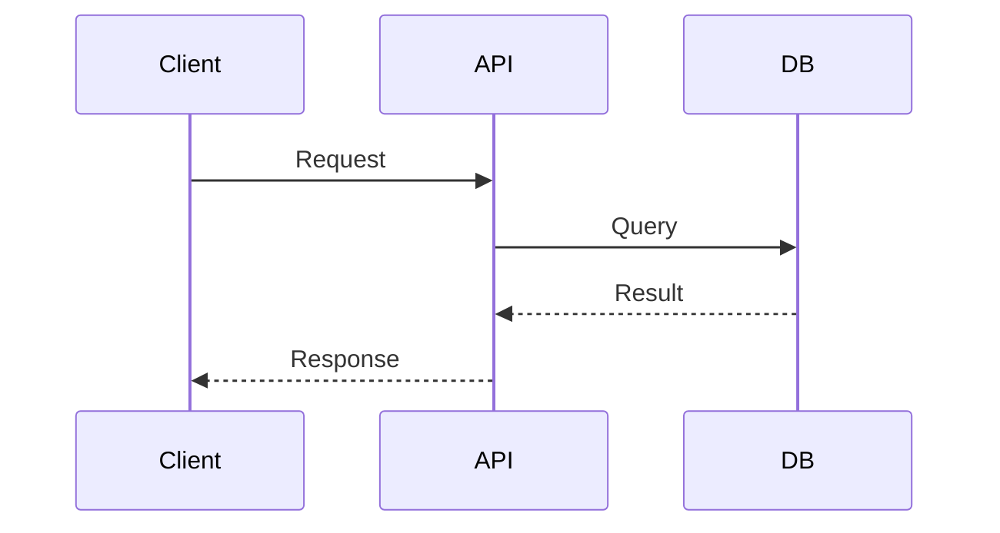
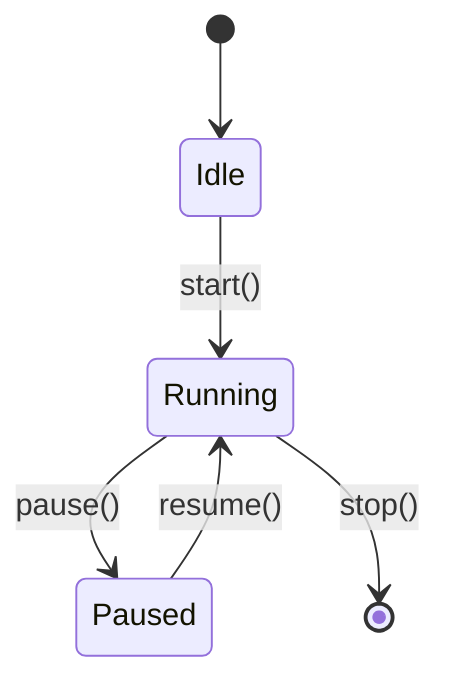
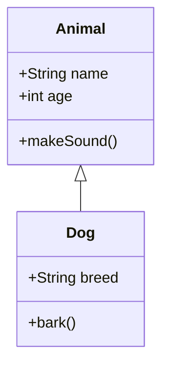
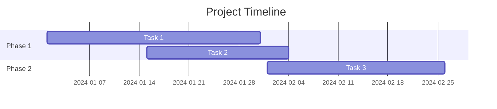
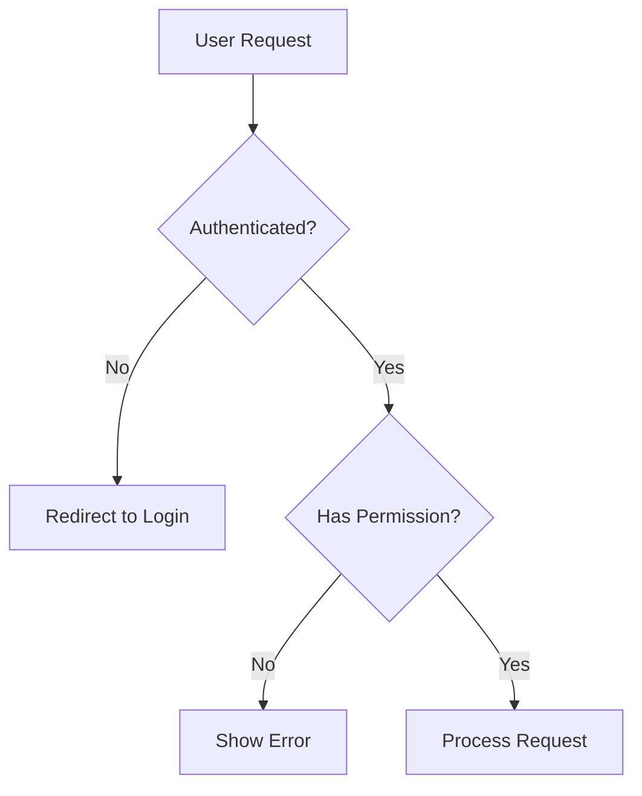
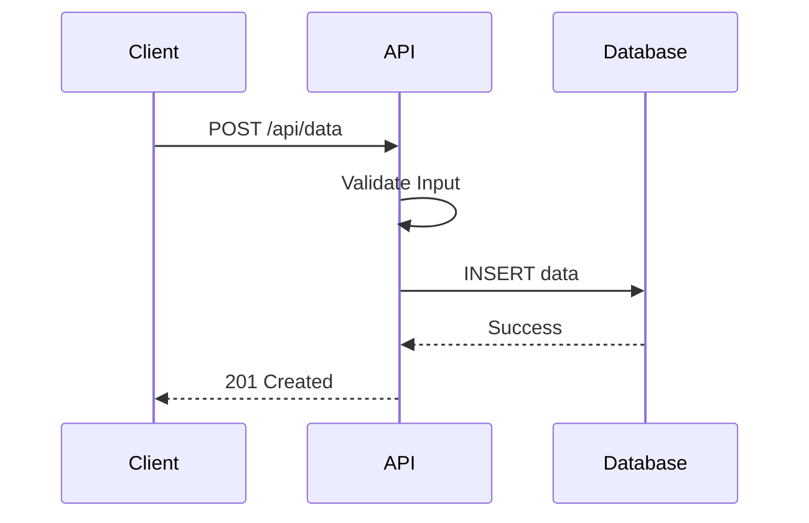
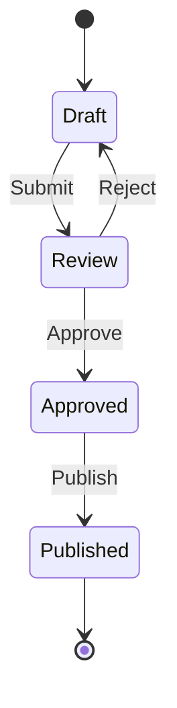

# Mermaid Workflow

Create Mermaid diagrams for technical documentation and visualization.

## When to Use Mermaid

Mermaid is ideal for:
- **Flowcharts**: Process flows, algorithms, decision trees
- **Sequence diagrams**: API interactions, protocol flows
- **State diagrams**: System states and transitions
- **Class diagrams**: Object relationships
- **Gantt charts**: Project timelines
- **Git graphs**: Branch and merge visualizations

## Mermaid Diagram Types

### Flowchart (Most Common)



**Directions:**
- `LR`: Left to Right
- `TD` or `TB`: Top Down/Top to Bottom
- `RL`: Right to Left
- `BT`: Bottom to Top

**Node Shapes:**
- `[Text]`: Rectangle
- `(Text)`: Rounded rectangle
- `{Text}`: Diamond (decision)
- `([Text])`: Stadium shape
- `[[Text]]`: Subroutine
- `[(Text)]`: Cylindrical (database)

### Sequence Diagram



**Arrow types:**
- `->`: Solid line
- `-->`: Dotted line
- `->>`: Solid arrow
- `-->>`: Dotted arrow

### State Diagram



### Class Diagram



### Gantt Chart



## Best Practices

1. **Keep it simple**: Don't overcomplicate
2. **Use clear labels**: Make text descriptive
3. **Logical flow**: Follow natural reading direction
4. **Group related items**: Use subgraphs when appropriate
5. **Test rendering**: Ensure it renders correctly

## Common Patterns

### Decision Tree



### API Flow



### State Machine



## Output Format

Present Mermaid diagrams with:
1. Brief description of what it shows
2. The Mermaid code block
3. Explanation of key elements

```
Here's a flowchart showing the deployment process:

[Mermaid diagram code]

The diagram illustrates:
- [Key element 1 explanation]
- [Key element 2 explanation]
```
