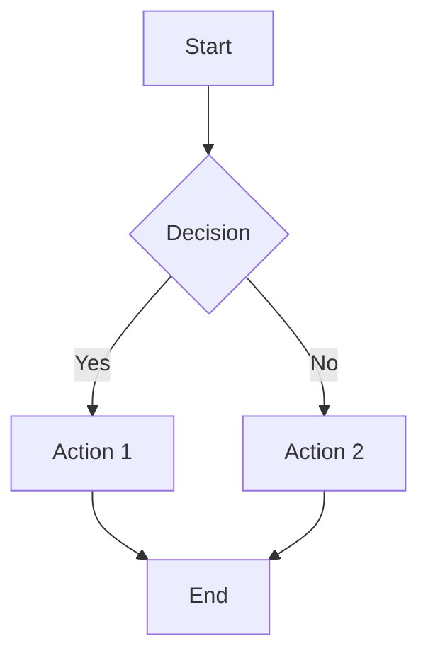
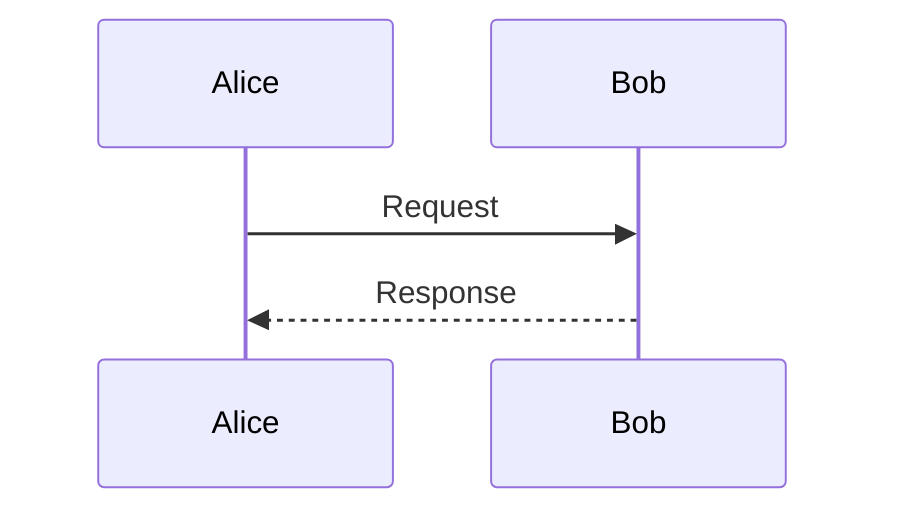
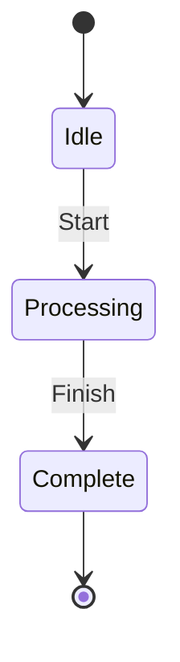

# Visualize Workflow

Create visual content to explain concepts, processes, or relationships.

## Steps

### 1. Understand the Content

Ask:
- What needs to be visualized?
- What's the key insight or relationship?
- Who's the audience?
- Where will this be used?

### 2. Choose the Right Format

**Mermaid Diagrams** - When you need:
- Flowcharts (process flows, decision trees)
- Sequence diagrams (interactions over time)
- State diagrams (system states and transitions)
- Class/ER diagrams (relationships)
- Gantt charts (timelines with tasks)

**Tables** - When you need:
- Comparisons (side-by-side evaluation)
- Feature matrices
- Decision matrices

**ASCII Art** - When you need:
- Terminal-friendly diagrams
- Code comment diagrams
- Simple box-and-arrow layouts

**Structured Text** - When you need:
- Hierarchies (org charts, file trees)
- Simple timelines
- Process steps

### 3. Create the Visualization

Follow these principles:
- **Clear labels**: Every element should be clearly labeled
- **Logical flow**: Left-to-right or top-to-bottom
- **Minimal complexity**: Only include what's necessary
- **Consistent style**: Use consistent shapes and connections

### 4. Mermaid Syntax Reference

**Flowchart:**


**Sequence Diagram:**


**State Diagram:**


### 5. Present and Refine

- Show the visualization
- Explain what it represents
- Ask if refinements are needed
- Iterate based on feedback

## Output Format

Present the visualization with context:

```
Here's a [type] diagram showing [what]:

[The actual diagram/visualization]

Key elements:
- [Element 1]: [What it represents]
- [Element 2]: [What it represents]

This visualization shows [the main insight].
```

## Examples by Use Case

### Process Flow
Use flowchart when showing steps and decisions

### System Architecture
Use flowchart with boxes for components and arrows for data flow

### Comparison
Use table format for side-by-side evaluation

### Timeline
Use Gantt chart or ordered list depending on complexity

### Relationships
Use ER diagram or class diagram for entity relationships
